SIU 2010 sinyal işleme kurultayı bu yıl Diyarbakır Dicle Üniversitesinde düzenlendi. Ben de gitmek için kolları sıvadım ve çalıştığım konularla ilgili bir bildiri gönderdim ve ne mutlu ki kabul edildi ve Diyarbakır'ı görmüş oldum bu vesile ile.  
  
Tabi batı'da yaşayan ve çalışan insanlar olarak doğu ve güneydoğudaki illerimize çok sık gitmek mümkün olamıyor. Basından ve medyadan takip ettiğimiz olaylar silsilesi ile de ister istemez doğu hakkında kafamızda "olumsuz" bir resim çizilebiliyor.  
  
Kurultay kapsamında düzenlenecek olan gezilerde Diyarbakır, Mardin, Hasankeyf ve Midyat'ı göreceğimizi biliyordum ve ister istemez insanın aklına buralarda yaşanan terör olayları geliyor. Zira biz bu illerimizin isimlerini genelde terör olayları ya da türevleri ile ilgili haberlerde duyuyoruz.  
  
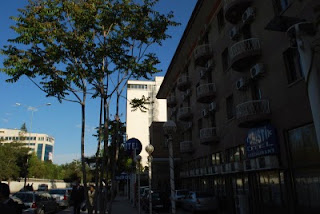

Neyse, velhasıl kelam ön yargıları bir kenara koyduk ve çıktık yola. Sunexpress'in İzmir - Diyarbakır direk seferleri var. Yol ortalama bir saat 45 dakika kadar sürüyor. Giderken yolculuk fena değildi ama dönerken uçaktaki 10 adet 0-4 yaş arası çocuk ve bebekler sağ olsunlar aynı anda gerek ağlayarak gerekse bağırıp çağırarak yolculuğun her anını beynime kazıdılar.  
  
Diyarbakır çok büyük bir şehir değil. Genelde şehir içinde bir yerden bir yere yürüyerek gitmek mümkün olabiliyor. Ben "Turistik Otel" diye merkeze çok yakın bir otelde kaldım. Sadece yatmak için ve duş almak için kullanmayı düşünüyorsanız fiyat performans açısından uygun bir otel. Ama ben konfor ararım  lobisi şık olsun artistik olsun derseniz Dedeman, Prestij otel ve Class Oteli de tercih edebilirsiniz.  
  
Diyarbakır şehri eski ve yeni olmak üzere iki bölüme ayrılmış. Eski Diyarbakır çevresi surlar ile çevrili bir alan. Bu surlar içerisi gerçek anlamda bir açık hava müzesi.  

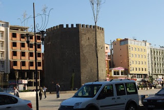    

Tabi zamanla oluşan tahribattan dolayı surların bazılarının arasındaki bağlantılar kesilmiş durumda. Ancak büyükşehir belediyesi suların onarımı ile ilgili kapsamlı bir çalışma başlatmış, şehrin bir çok bölgesinde surlar onarılmış ve onarılmakta.  
  
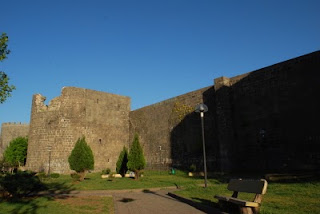    

Surlar burada sosyal hayatın ayrılmaz bir parçası olmuş. Sur boyunca parklar ve yeşil alan var. Ve birçok insan bu alanları güzel bir şekilde değerlendiriyor. En büyük zevkleri parkta oturup etrafta yoğun olarak satılan kabak çekirdeklerini çitlemek.  
  
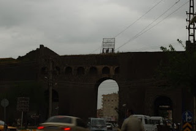    

Dedim ya burada surlar hayatın bir parçası. İnsanlar surları bir yerden bir yere ulaşmak için de yoğun olarak kullanıyorlar. Hatta araç trafiği de "Mardin Kapı" "Urfa Kapı" gibi geçitlerden ve aralarda bulunan daha ufak geçitlerden sağlanmakta.  
  
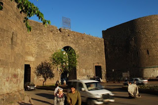    

Surların burçlarının da değişik isimleri var. Bunlardan en bilineni ve turistik bakımdan rağbet göreni de "Keçi Burcu". Keçi burcundan manzara gerçekten çok güzel. Ayrıca Burcun içi de turistik gezilere uygun hale getirilmiş.  

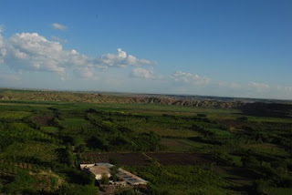    
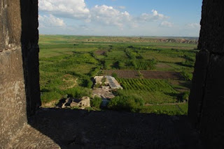   
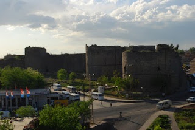    
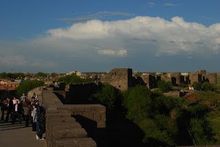    
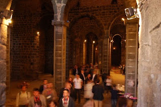    

Şehir gerçekten de bir açık hava müzesi. Gittiğimde öğlen saatine denk geldiğinden kiliselere giremedim ancak Ulu Cami'den güzel  fotoğraflar yakalayabildim. Diyarbakır'daki camilerde kubbe kavramı yok genelde çatıları var.  Tarihi camilerin minareleri de bizim şu anda gördüğümüz alışılagelmiş cami minarelerinden farklı. Yapılardaki ayrıntılar incelemeye değer. Özellikle gerek Diyarbakır gerekse Mardin mimarisinde göze çarpan şey renkler. Diyarbakır'da kullanılan volkanik taşların kendisine has gri bir rengi var. Mardin'de ise boz bir renk hakim. O yüzden Diyarbakır bana artık gri rengi çağrıştırıyor, Mardin ise alabildiğine "boz" bir imgeyi...  
  
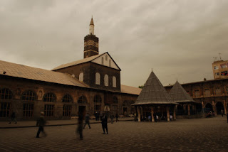    
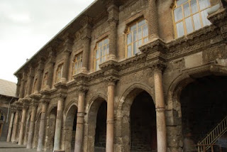    
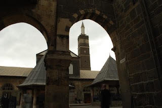    
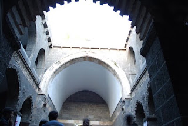   
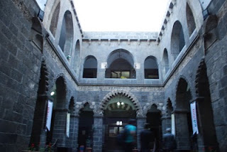   
  
Yöre mutfağında koyun eti hakim. Değişik yemekleri deneme şansım olmadı ancak kaldığım otele yürüyerek 300 400 metre mesafedeki meşhur "Kaburgacı Selim Amca" 'dan bir kaburga dolması yedim. Yemek standartta iki kişilik olarak geliyor ama tek başınızaysanız bir kişilik bir porsiyon ayarlayabiliyorlar. Diyarbakır'daki genel restoran lokanta fiyatlarına oranla biraz tuzlu bir yer olduğunu belirtmeliyim. Yemeğin sunumunu garson gerçekleştiriyor. Hızlı ve ustaca yemeğin kemiklerini ayıklıyor ve size ikram ediyor.   
  
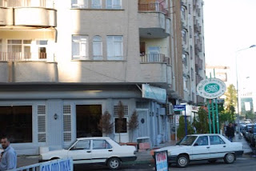    
  
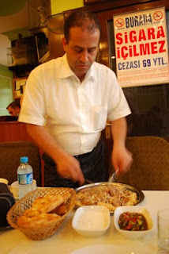    

Diyarbakır'da bizim batıda bildiğimiz ve kullanageldiğimiz ekmeklerden hiç görmedim. Genelde daha az mayalı ve daha az tuzlu, lavaş ile ramazan pidesi arası bir pide.  
  
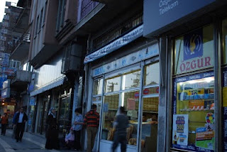    

Doğu ve güneydoğu Anadolu kültüründe önemli bir yeri olan dengbejlerin toplandıkları "dengbej evi" de güzel bir Diyarbakır evi örneğiydi. Dengbej kelimesinin türkçe tam karşılığı yok sanırım ama "kürt ozanı" diye çevirilebilir. Yalnız anadolu halk ozanları bildiğiniz gibi saz çalıp saz eşliğinde şarkı söylerler, dengbejler ise yalnızca insan sesi kullanarak sanatlarını icra ediyorlar. Değişik bir gırtlak hareketi ile kendilerine has bir söyleyiş tarzı elde etmişler. Dengbej evine gittiğimizde orada yaşlı bir dengbej vardı ve kısa birkaç  türkü seslendirdi.    
  
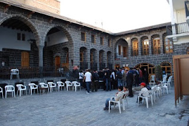    
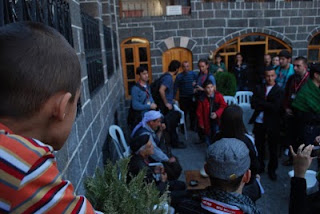      
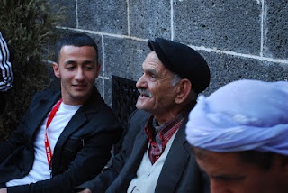    
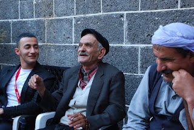    
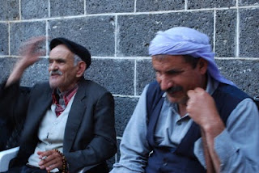    

Sempozyum Dicle Üniversitesi kampüsündeki Kültür Kongre merkezinde gerçekleştirildi. Çok büyük ve güzel bir kongre merkezi yapılmış üniversiteye. Özellikle A salonunun büyüklüğü beni gerçekten çok şaşırttı.   

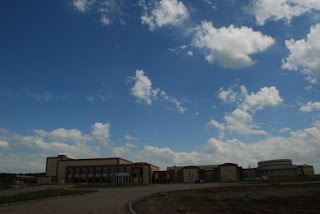    
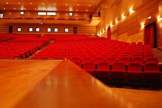    

Üniversiteden mezun olduğumdan beri  görmediğim benimle ODTÜ Elektrik-Elektronik'te aynı dönemden olan arkadaşlarla tekrar karşılaşmak da çok iyi oldu.   

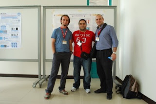   
  
23.04.2010 akşamı saat 19:00 dolaylarında sempozyum bitti ve dışarı çıktığımızda şu renk bir gökyüzü vardı;   

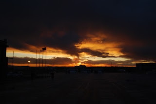   

SIU2010 vesilesiyle Diyarbakır dolaylarını da görmüş ve bir nebze olsun tanımış oldum mutluyum ...
