Vaay vay amma zaman olmuş blog yazısı yazmamışım!! Nasıl blog bu ya, madem yazmıcan neden hala açık? Olsun ama olsun arada bir gene yazıyorum artislik yapmayım kendi kendime.  
  
8 Temmuz 2011 tarihinde İstanbul'da gerçekleştirilen bir Bon Jovi konseri oldu... Ben de eş durumundan bir Bon Jovi hayranı olarak konsere gittim...  Bi kaç foto çektik ama şimdi burda o fotoları koymanın bir anlamı olmayacak. Zaten tribünlerden izledik konseri, Bon Jovi soğanın cücüğü kadar bile görünmüyordu bulunduğumuz yerden.   
  
Bizim için de tecrübe oldu... İlk kez stadyum da ( ki Telekom Arena stadında oldu konser, bayaaa büyük bir alan yani) konser izleyeceğimizden bilemedik. Hesaplı olsun diye gittik tribünden bilet aldık. Ama zaten İzmir'den İstanbul'a gelmek ve İstanbul'da iki gece kalmak, gezmek falan yeterince az hesaplı bişey olduğundan konseri hesaplıya getirmenin bi anlamı olmadı aslında. Bir daha böyle bir konsere iştirak edecek olursak "Diamond Ring" den aşağısı kurtarmaz, hah şuraya da yazıyorum...  
  
Yine de benim için bu İstanbul gezisinin daha güzel tarafı yıllar sonra (6 yıl falan) tekrardan (tabi bu sefer eşimle birlikte) tarihi mekanları gezmek idi. Seviyorum ben bu İstanbul'un tarihi dokusunu.   
  
Konserden sonraki sabah İstiklal caddesindeki iğrenç otelimizden sabahın köründe kaçarcasına ayrıldık. Atladık tramvaya doğru Tünel.  
  
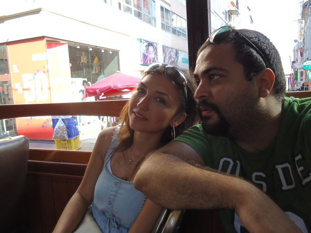

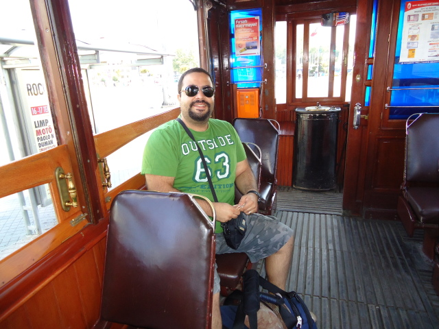
  
Sonrasında  füniküler (eğik asansör gibi bişey) ile Karaköy, oradan da metro ile Sultanahmet semtine gittik. Önce ikinci geceyi geçireceğimiz oteli bulduk. Yeri Pier Loti caddesinde, ama tabi Pier Loti diye bir kafe midir nedir onun olduğu yerle karıştırmamak lazım. Bu Pier Loti caddesi Sultanahmet semtinde. Yokuştan aşağı salıyosun kendini bi 300 500 metre sonra yanlış hatırlamıyorsam tarihi Kadırga Hamamının orda bir yerlerde [Fors Hotel](http://www.forshotel.com/) diye bir yer. Mutlaka tavsiye ederim, zaten istiklaldeki oteli ben tamamen mallamasına seçmiştim, tam anlamıyla afedersiniz ama sıçmalardan seçmeler olmuş. Neyse Özge (eşim) tripadvisor sitesinden bu oteli buldu. Mevki ilk başta biraz garip gelebilir göze  ama gerçekten güzel bir otel. Zaten çoğunlukla da yabancı turistlerin tercih ettiği bir mekan. Gönül rahatlığıyla tercih edip kalabilirsiniz. Çoluk çocuk, karı-koca allah ne verdiyse o an...  
  
Neyse çantamızı otele bıraktık ilkin Sultanahmet Camisine yöneldik. Dikilitaş var orda biryerlerde. Standart turist fotolarımızı çektik tabii...  
  
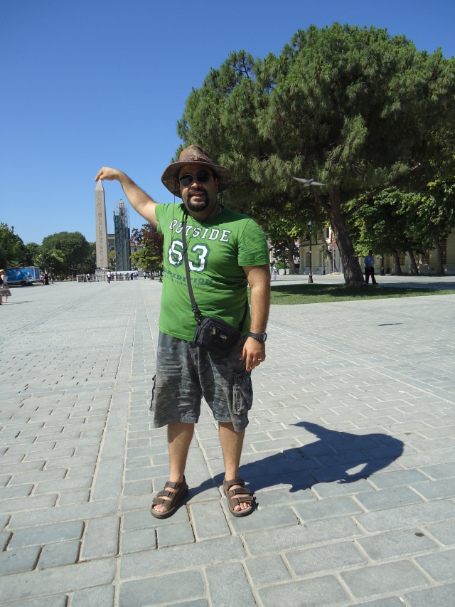
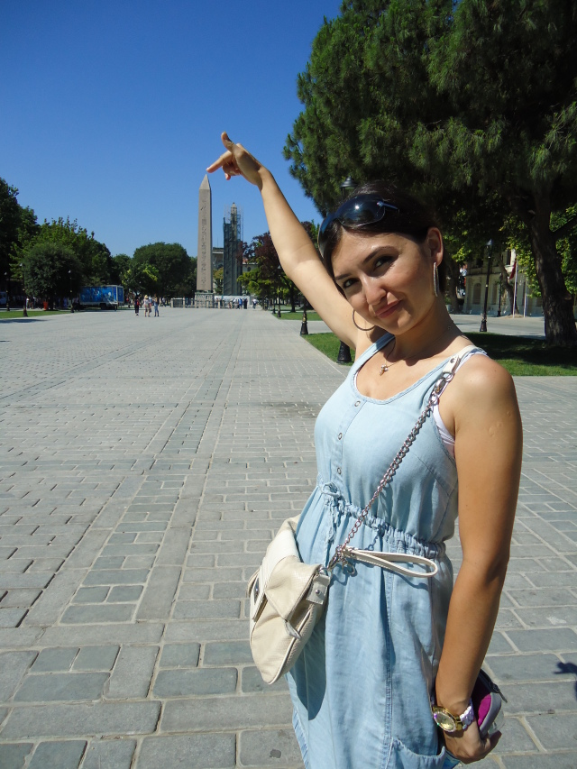  
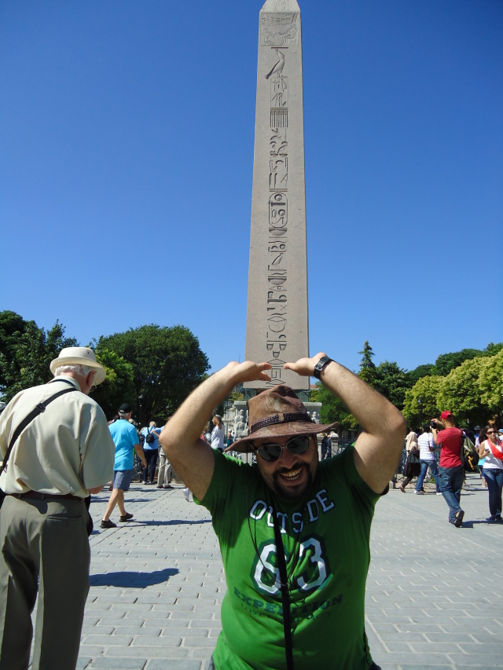  
  
Tabi şu son resimde görüleceği üzere hepsinde başarılı olamadık. Sonra camiyi gezdik ....  

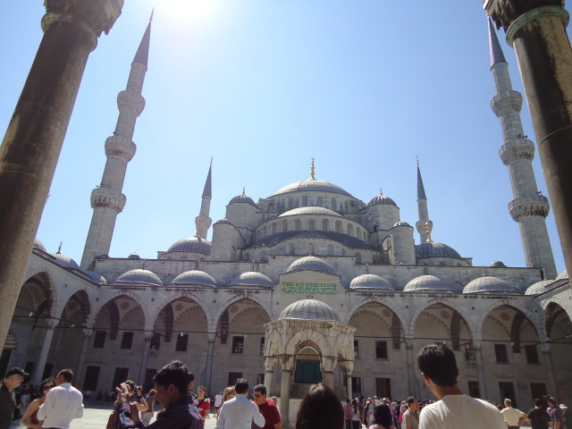  
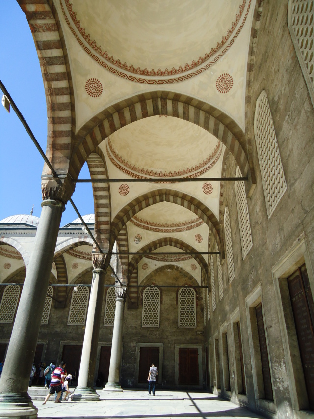  
  
Kocaman bir camii, tabi sabah sabah bu kadar yürümek göbek de büyük olunca yorucu olabiliyor. O yüzden ben de Sultanahmetin abdest çeşmelerinde elimi yüzümü hatta ayaklarımı yıkama ihtiyacı hissettim.  

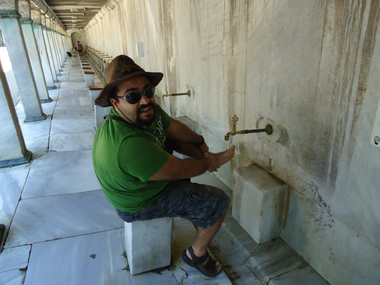  

Zaten hemen karşısı Ayasofya... Vakit kaybetmeden oraya gittik.  6 7 sene evvel geldiğimde Ayasofya'nın içi halen tadilattaydı. Kubbesini falan göremiyordun. Şimdi iskeleler kaldırılmış, restorasyon çalışmaları bitmiş ve o inanılmaz kubbeyi dünya gözüyle gördük ya, mutlu oldum ne diyeyim. Adamla evreni sembolize etmek için alabildiğine büyük yapmışlar o kubbeyi. Hatta oradaki tarihi bilgilere göre caminin son hali 582 ve 587 yılları arasında yapılmış ve yapıldığında hristiyan aleminin en büyük ibadet yeriymiş. Ayrıca bugüne kadar sapasağlam kalmasını da Mimar Sinan'ın güçlendirme çalşmalarına borçluymuş.  

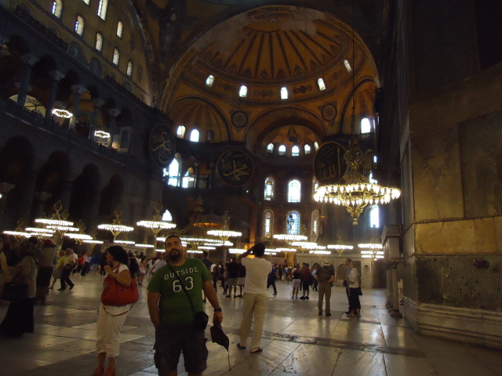  
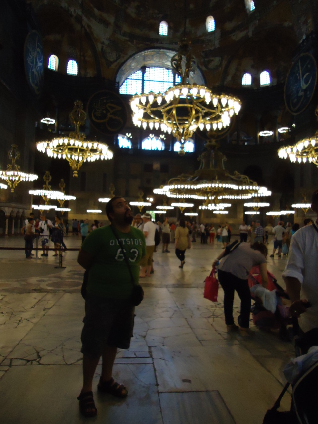  

İçerde caminin restorasyonu sırasında ortaya çıkarılan mozaiklerin fotoğraflarıyla hazırlanmış bir sergi vardı. Dayanamadık yine o turistik fotolardan çektik.  

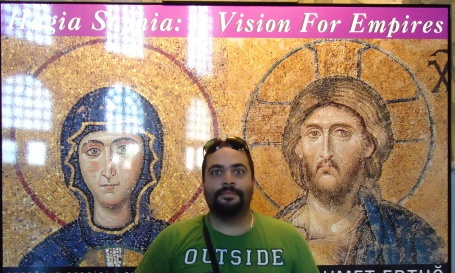  
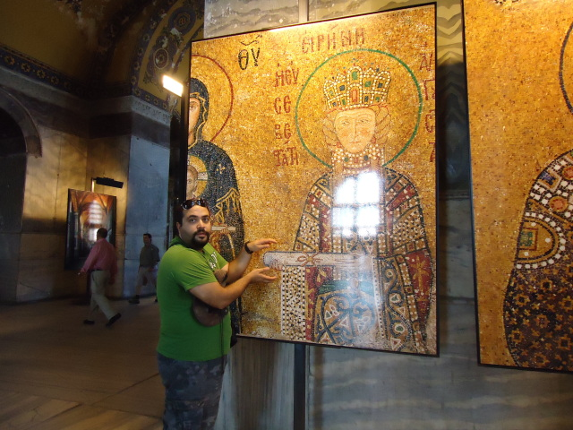  

Cami bu arada sevimli bir konuğa da ev sahipliği yapıyor (kanal d anahaber cümlesi gibi oldu ha!). Cidden ama çok sevimli bir kedi var, orda takılıyormuş. Eleman şaşı olduğu için ekstradan sevimli. Bir fotosu var ama şaşılık pek belli olmuyor, gidip kendi gözünüzle görün derim.  

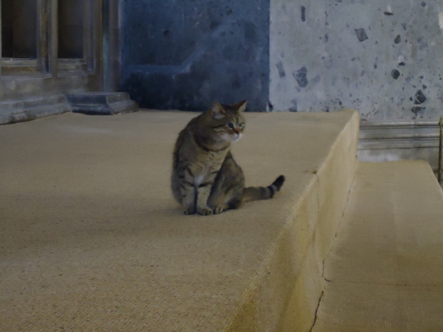  
    
Aynı gün hadi oldu olacak yerebatanı da gezelim dedik ve gezdik. Müze kart geçmiyormuş ilginçmiş. Sarnıçtaki en ilginç şeyler suda yüzen danalar gibi büyümüş balıklar ve iki sütunun altında (nedense) yan duran medusa kafaları. Vallaha bence iki olasılık var birisi gerçekten de adamlar bi mesaj vermek istemişler gizli bir şifre, davinci'nin şifresi hesabı. İkincisi ise gayet o kafa sütunun altına uzun geldi baktılar ki olmayacak yan koyalım dediler, fazla kasmadılar  yani...  

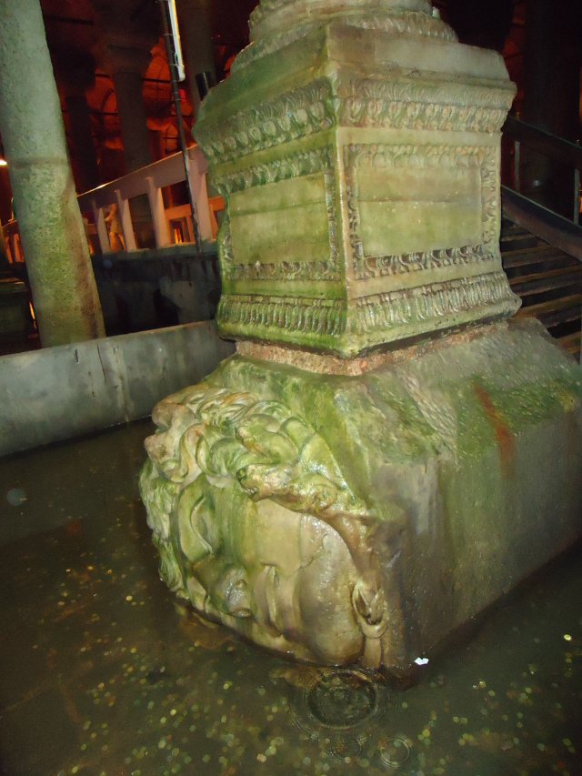  
  
9 Temmuz'daki turistik gezi bu şekilde bitti. Akşam arkadaşlarla buluşmaca, eski günleri anmaca falan. 10 Temmuz sabahı güzel bir otel kahvaltısından sonra yeniden yollara koyulduk. Bu sefer yanımızda çanta da olacağından, e tabi yiğitlik de var, karım der "gel beraber taşıyalım" ben "olur mu canım şu kadarcık çantayı mı taşıyamıcaz" diye diye 5 saat taşıdım çantayı. O maks 6 kiloluk çanta oldu gülle bana. Ama iman gücü var vesselam taşıdım gene de.   

Neyse, Topkapı sarayı zaten bence komple bir ikigün gezilmesi gereken bir yer. Ama tabi yanınızda çanta falan olmayacak mümkünse. Bu arada Topkapı'da da salakça bir olay var. İçeriye girişte müze kart geçiyor güzel güzel. Sonra içeri girdikten sonra şayet Harem bölümün gezmek isterseniz 15 TL daha veriyorsunuz. Bu saçmalık 6 7 sene evvel de böyleydi halen değişmemiş. Zaten harem dışındaki yerlerde yeterince yorulduğumuzdan bu sefer de hareme girmedik. Ha 15 tl karşılığında bizi el arabasıyla falan gezdirecek olsalardı girerdik vallaha...  

Sarayın avlusunda dinlendikten sonra hemen yanda bulunan Arkeoloji müzesini de gezelim dedik. Bu arada o müze de kesinlikle en azından 1 gün ayrılarak gezilmesi gereken gayet dolu dolu bir müze. Orda da gitmişken birkaç turistik foto çektik.   

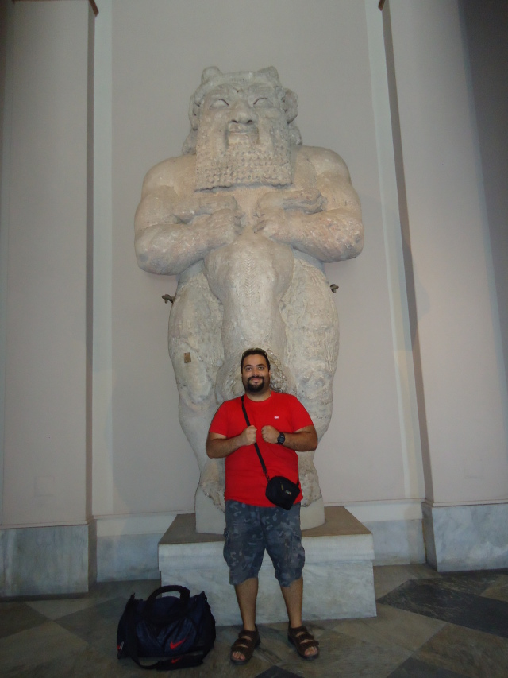  
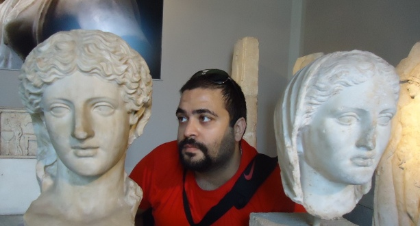  

Yok abi yok... İstanbul insan ömrü ile bitecek bir yer değil. Ve gözlemleyebildiğim kadarıyla orada yaşıyor olsan bile İstanbul'u "bilmek" pek de mümkün bişey değil...