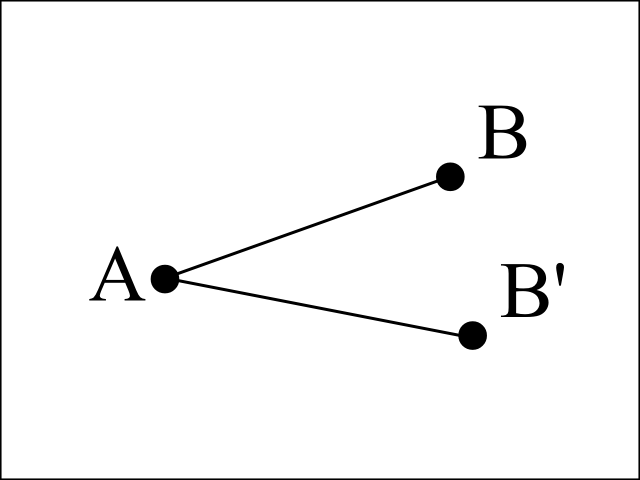

  
Dört aylık olan oğlum Erkan'ın gaz sancısı vardı dün gece. Annesini sabaha kadar uyutmamış. Sabah 6'da  görevi ben devraldım. Neyse ki yirmi dakka içinde uyuttum ama bu sefer de ben uyuyamadım. Ona baktım, onu ve geleceğini düşündüm ister istemez. Ne olacak memleketin hali, yavrularımızın durumu falan derken kendimi bir düşünce denizinde buldum.  
  
Ülkemizde, ki Dünya'daki birçok başka ülkede de, zamanın ruhuna uygun problemler almış başını gitmiş. Terör olayları, süregelen  ve muhteviyatını asla kavrayamadığımız belki de anca bundan 20 30 sene sonra kavrayayazacağımız dava süreçleri derken gündemi takip edip akıl sağlığından olmamak elde değil.   
  
Ancak sıradan vatandaş olarak ben biraz daha soft ancak derin bir mesele olan "eğitim" ile  ilgili düşüncelerimi dile getirmek istiyorum. Zira bu meselenin, gündemdeki diğer büyük olaylarla bir alakası yoksa, sıradan vatandaşın hayatındaki en önemli mesele olması gerektiğini düşünüyorum. Ayrıca memleketin dünü ve bugününü de bu bağlamda ele almanın önemli olduğunu düşünüyorum. Gelecek nesillere belki biraz faydası olur ileride "dün"lerini  okumak açısından...    
Olayları mühendis kimliğimi kenara bırakarak duygusal açıdan ele almak isterdim ama bu mümkün olamıyor. Zira Türkiye'de bize öğretilen yakın tarihten ya da bugün yaşadıklarımızdan gözlemlediğim kadarıyla önemli "toplum mühendisliği" çalışmaları yapılmış ve yapılmakta.    
Bir tarihçi olmadığım için kronolojiye ya da kronolojik sırayla anlatmaya çok alışkın değilim ama deneyeyim.   
  
Büyük kurtuluş savaşımız ve Cumhuriyet'in kuruluş yıllarına dönelim. Dönemin en önemli kişisi olan Mustafa Kemal ve onunla birlikte çalışan arkadaşları yeni bir yönetim biçimi ve yepyeni bir ülke inşa etmeye çalışmışlar. Dönemin "toplum mühendisleri" olmuşlar. Hedeflerinin "bir ülkeyi A noktasından B noktasına getirmek" olduğunu düşünürsek, bu hedefi gerçekleştirmenin en verimli ve hızlı yollarını düşünmüşler ve "iki nokta arasındaki en kısa mesafe bir doğru parçasıdır" mantığıyla ilerlemeye çalışıp kendilerine çok zor hedefler koyarak B noktasının yakınlarında bir B' noktasına kadar gelmeyi başarmışlar.  
  
  
    
  
Birçok doğru ve güzel iş yapılmış. Ancak bunların yapılması esnasında önemli bir toplumsal karşı mukavemetle karşılaşılmış. Örneğin yapılan önemli değişikliklerden birisi olan alfabe devrimini düşünelim. Bu konuda kendi çapımda benim de çalışmalarım ve gözlemlerim var.   
Alfabe devriminden önce hepimizin bildiği gibi "Osmanlı Elifbası" kullanılmaktaydı. Bu alfabe Arapça ve Farsça alfabelerinin bir sentezidir. İkisini de içerir. Ancak dilin temelinde Türkçe olması, bu alfabelerin orjinal kullanımlarının dışında bir kullanım şekli ile tamamen yeni bir yaklaşımla kullanılmalarını gerektirir. Örneğin Arap dilinde yazıda sesli harfler kullanılmazken Türkçe bir kelimenin yazımında sesli harfler kullanılmaktadır. İşte benim gözlemlediğim en kilit zorluk bu. Osmanlıca olarak bilinen dil çok sayıda Arapça ve Farsça kelimeyi içermektedir (Bugün bile birçok Arapça ve Farsça kelime zaten dilimizde var). Bu kelimelerin Osmanlı alfabesiyle doğru yazılması, bu yabancı kelimelerin esas yazılışlarının doğru şekilde bilinmesiyle mümkün olmaktadır. Yani bu kelimelerin Osmanlı Elifbası kullanılsa dahi okunduğu gibi yazılmaları yanlış olmaktadır.   
Bu bakımdan özellikle Türk dili için Osmanlı alfabesinin yetersizliğini tartışmaya gerek bile yoktur. Latin alfabesi çok kolaydır ve  bir iki modifikasyonla (ç,ğ,ö ve ş gibi) dilin gerekliliklerini karşılamaktadır. Bu sayede okuma yazmayı özendirmek ve öğretmek çok daha kolay olmaktadır. İşte bu sebepledir ki artık okuma ve yazma seçkin müderrislerden halka inebilmiştir.    
Ancak bence bu noktadaki sorunsal alfabenin tamamen yasaklanmasında ve reddedilmesinde yatmaktadır. Zira Kur'an alfabesi olarak da bilinen Arap alfabesi toplumun büyük bir kesiminin nazarında kutsiyet arz etmektedir ve öyle ya da böyle bilinmektedir. Buna mukabil, her ne kadar yeni alfabe mükkemmel olsa da, özellikle yaşı belli yaşın üzerinde olan özellikle muhafazakar kişilerin buna mukavemet göstermelerine şaşırmamak gerekir. (Örneğin bugün bir harf devrimi yapıldığını ve yarın bütün yazılı kaynakların Kiril alfabesinde çıkarıldığını düşünelim ve empati kurmaya çalışalım).   
Daha önce de bahsettiğim gibi kendim bireysel olarak Osmanlıca konusunda biraz çalışma yaptım. Bunun en önemli sebebi yakın geçmişe ait eserlerde, sayfalarda ve hatta fotoğraf arkalarında bu alfabe ile yazılı birçok şey görmem ve bunları anlayamamamı anlayamamamdır. Örneğin Osmanlı'nın kalıcı eserler bıraktığı Bursa'yı İstanbul'u düşünelim. Her an karşınıza tarihi bir çeşme, bir kapı ya da bir mezar taşı çıkar ve bön bön orada ne yazıyor olabilir diye bakarız çoğumuz. İşte bu hissiyat açıkcası beni hep rahatsız etmektedir.   
Osmanlıca bence kültürel bir değerdir. En azından bu dilin öğrenilebilmesi için bazı kanalların açık bırakılmış olması çok güzel olurmuş gibime geliyor. Tabii ki buna karşı şu argüman geliştirilebilir; **"O günkü ortam buna müsait değildi ve değişimin hemen olması gerekiyordu, bir devrim gerekiyordu"**... Belki doğrudur ancak benimkisi bir gözlem. Oturduğum yerden tam olarak bilmediğim ve bilemeyeceğim geçmiş hakkında "gözlem" yapmak da ne kadar doğru bilmiyorum. Ama o dönem yapılan, alfabe sadece bir örnek, çok hızlı devrimsel değişiklikler (ki zaten o yüzden adı devrim) ve o değişikliklere karşı oluşan ve etkisi günümüze kadar gelmiş olan toplumsal mukavemeti düşününce belki de "devrim" gibi iddialı bir şekilde yola çıkmaktansa daha yumuşak ve kademeli bir geçiş gerçekleştirmek daha doğru olabilirdi diyorum. Ancak ne yazık ki çeşitli sebeplerden dolayı tarihimizde pek böyle olmamış ve halen de olmuyor...  
  
Düşmanın bildiğini dosttan saklamayalım. Benim üniversiteye girdiğim yıllarda (1997), 28 Şubat süreci olarak bilinen süreçte, yine değişik sebeplerden eğitimde bir "reform" gerçekleştirildi ve **"****8 yıllık kesintisiz eğitim** " adı altında bir sisteme geçildi. Bu süreçte İmam Hatipler kapatıldı. Ama başka birşey daha oldu. Bence ülkenin en değerli eğitim kurumları olan Anadolu Liseleri de yok oldu.   
  
İzmir'li olduğum için, kendim oralarda okumamış olmama rağmen, Anadolu Liselerinin ne kadar başarılı okullar olduğunu çok iyi biliyorum. Zira yine o yıllarda, hemen 8 kesintisiz eğitim öncesinde, İzmir üniversite sınav başarısında en üst sıralarda idi. 2012 yılına gelindiğinde ise aynı şehrin 17. 18. sıralarda olduğunu duyuyoruz. Sırf bu sonuç bile ne kadar büyük bir yanlış yapıldığını göstermeye bence yetmektedir. Artık üniversite sınav başarısının olmazsa olmaz tek şartı "iyi bir dershane"ye gitmektir. İşte bu da kendi mağdurlarını yaratmış bir dönüşümün hikayesidir.  
  
Peki şimdi 2012 ye geldik, adına uzuun uzun "Dört artı dört artı dört", kısaca "dört çarpı üç" ya da Başbakan'ın deyimiyle "Kod adı 444" denilen bir sistem daha geldi. Bu sistemin geleceğine dair ilk haberler çıktığında ben açıkcası bunun önemli ve olumlu bir gelişme olacağını sanan saflardan birisiyim. Zira benim düşünceme göre bu sistem ile beraber AKP iktidarı İmam Hatip gibi meslek okullarına haklarını geri verecek ayrıca bu sayede Anadolu Liseleri yeniden eski yapısına kavuşacaktı. Ben de oğlum için gelecek planları yaparken onu bu okullara yönlendirecektim falan...   
  
444 geldi, İmam Hatiplere hakları devredildi bununla kalınmadı bir sürü okul İmam Hatip'e dönüştürüldü ama ben vatandaş olarak bundan ötesini göremedim. Bakanlar, sivil toplum kuruluşlarının yöneticileri sürekli  tartışıyorlar... Ama tartışma hep aynı kısır konu üzerinde yine mevzu hep "İmam Hatip"ler, açılacak olan seçmeli Kur'an ve Hz.Muhammed'in Hayatı dersleri. Bir aklı selim kişi de ne olacak bizim Anadolu liselerimiz, Fen Liselerimiz diye sormadı, sormuyor. **2012-1997=15**  yıl herşeyi unutmak ve unutturmak için yeterli bir süre Türkiye'de... Eskiden genelde okumaya niyeti olmayan zengin çocuklarının gönderildiği kolej kavramı şu anda ortagelir düzeyi üzerindeki aileler için neredeyse eğitime tek çare durumuna geliyor. Üzücü bir durum.  
  
Sonuç olarak 444 de kendi mağdurlarını yaratan bir dönüşümdür. Olumsuz etkilerini yakın gelecekte göreceğiz. Ancak her ne kadar çok belli edilmese de bu eğitim reformu iktidar partisinin 2023 hedefleri içerisinde önemli bir yer tutmaktadır. Bence 4+4+4=12 sayısı ve 2012 yılı rastgele sayılar ve yıllar değildir. Ayrıca benim tanık olduğum Türkiye tarihinde ilk kez bir parti bu kadar organize ve planlı çalışıyor. 2023 yılına gelindiğinde Türkiye'de halen aynı istikrarla devam eden bir AK Parti hükümeti olursa tablo şu olacaktır; "en az 3 çocuk" mantığıyla çoğalmış güçlü genç ve muhafazakar bir nüfusa sahip bir Türkiye. Öyle ki bu kişiler istenilen biçimdeki 12 yıllık temel eğitimlerini de  almış potansiyel bir iş gücünü yaratacaklar. Muazzam bir ekonomik güç...    
  
Tabii ki bu senaryonun olumlu bir yorumu. Zaman ne gösterir bilemeyiz. Zira Dünya'daki dengeler sürekli olarak değişiyor. Her 10 yılda bir birçok büyük olaylar yaşanıyor. Yeri geliyor ülkeler yıkılıyor yerlerine yenileri kuruluyor. Her zaman haraketli olan bizim coğrafyamızda da işlerin yüzde yüz kontrollü gidebileceğine inanmak ve bu şekilde katı ve tavizsiz "toplum mühendisliği" icraatları gerçekleştirmek  problemlere yol açıyor. Bunu birçok kereler tecrübe etmiş olmamıza rağmen halen aynı politikayı uyguluyoruz. Artık çok beylik bir köşeyazısı lafı olacak ama; gücü elinde bulunduran kendisi için "iyi" bir "şey" yaparken "mağdur"larını yaratıyor, ne zaman ki "mağdur" durumundaki "muktedir" oluyor, o da aynı şekilde kendi "mağdur"unu yaratmaktan geri kalmıyor. Kısır bir döngüdür gidiyor, bu arada bizim hayatlarımız da geçip gidiyor. Oyuncular değişiyor ama oynanan oyun küçük dekor ve makyaj farklılıklarıyla da olsa aynı. "İnsan" gene insan işte...   
  

